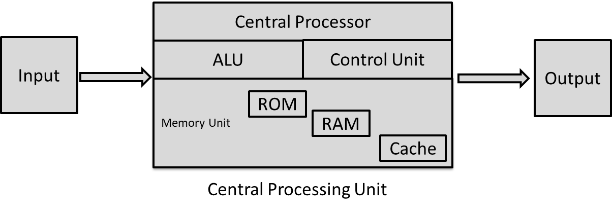

# CUDA Programming

## CPU

CPUs and GPUs are designed with different goals in mind. CPUs are designed to execute a sequence of operations in a given context or thread as fast as possible, whether it is doing matrix multiplications, reading/writing disk, and multi tasking.

</img>

Although this generalization in design enables us to use it in various and complex environments, it constraints us in tasks that require high memory and high throughput i.e 200K x 200K matrix multiplication. Despite the simplicity of the task it takes considerably long time to get a result.

Modern processors pack multiple processing units or cores. Each core can only run 1-2 threads in parallel without performance loss. However, we are hardware and financially constrained with the number of cores we can put in a single unit due to the complexity in design.

## GPU

The efficiency of the GPU architecture made it feasible to parallelize simple operations that required high memory and throughput. It does so by packing lots of threads and cores, sacrificing the single thread performance for greater throughput. Instead of using a large number of transistors for large data caches and complex flow control units, we devote these transistors for data processing.

</img>

### Thread Hierarchy

Threads are grouped in what is called a *block*. For convenience, a block can consist of a vector of threads, a matrix of threads, or a volume of threads. This provides a natural way to invoke computation across the elements in a domain such as a vector, matrix, or volume. On current GPUs, a thread block may contain up to **1024** threads and thread blocks are limited by the amount of *Streaming Multiprocessors* or cores.

</img>

At the start of each computation, we specify the number of blocks and the number of threads per block. For example, consider we have a *10x10x2* volume and we want to add multiply each element by itself. If we set the number of blocks to 1 and the number of threads to 200, then the computation on each element will be run on a separate thread. When the data is large, we can increase the number of blocks and distribute the computation on multiple blocks.

## References
- https://docs.nvidia.com/cuda/cuda-c-programming-guide/index.html
- https://developer.nvidia.com/blog/even-easier-introduction-cuda
- https://docs.nvidia.com/deeplearning/performance/dl-performance-gpu-background/index.html