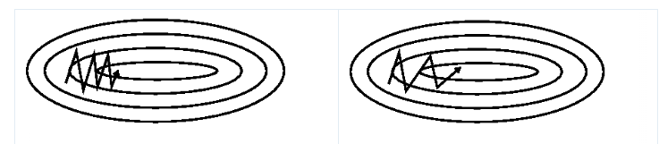

# Optimization

Optimization is the corner stone of deep learning, and is applied to almost all fields in engineering and science. As humans, we are usually interested in understanding the behaviour at the boundaries and extremes. When we plot $f(x)=x^2$, the first thing we look at is the point $(0, 0)$ which is coincidentally the minimum.

Identifying special points like the minimum, and maximum in a system helps us in solving lots of problems. A factory can maximize its daily produced units by identifying the optimal operating times, and amount of raw material. A trader can minimize the losses of a portfolio of stocks by changing the amount of money invested in each stock. The list is endless!

## Algorithms

Analytically, we minimize a function of multiple variables by taking the derivative of the function with repect to its variables and setting it to zero. However, we need to come up with iterative algorithms to numerically solve them on computers.

One way to look at it is, what is the value of $x$ that when slightly changed by a small value $\epsilon$ does not change the value of the function $f$. 

$$f(x) \approx f(x + \epsilon) \approx f(x - \epsilon)$$

We can calcuate the gradient of a differentiable function $f$ at $x=x_o$ using the central difference method:

$$f^{\prime}(x) = \frac{f(x_o + \epsilon) - f(x_o - \epsilon)}{2\epsilon}$$

The origins of central difference come from Taylor expansion where functions can be expressed using their derivatives:

$$f(x + \epsilon) = f(x) + f^{\prime}(x) \frac{\epsilon}{1!} + f^{\prime\prime}(x) \frac{\epsilon^2}{2!} + ...$$

### First Order Methods

First order methods are algorithms that use only the function's first derivative or gradient to reach a minimum. These methods are mostly used in deep learning due to its simplicity.

#### Gradient Descent

One of the first methods used in deep learning. On each iteration, the parameters are updated in the direction opposite to the gradient. The magnitude of this update is determined by the learning rate $\mu$.

$$x_{t+1} = x_{t} - \mu \nabla f_t$$

#### Momentum

Gradient descent struggles when traversing a nearly flat surface or a around a local minimum. It starts to oscillate across the slope while making little progress toward the minimum. We can accelerate the process by adding a fraction of the gradient of the previous time step to the current time step. It is similar pushing a ball down a hill.

$$g_t = \nabla f_t + \gamma g_{t-1}$$
$$x_{t+1} = x_{t} - \mu g_t$$

The momentum term $\gamma$ determines the magnitude of the contribution of the previous time step. It increases updates for dimensions whose gradients point in the same directions and reduces updates for dimensions whose gradients change directions. As a result, we gain faster convergence and reduced oscillation

#### Nesterov Momentum
One issue of momentum is that the steps do not slow down enough at the bottom of a valley and tend to overshoot the valley floor. Nesterov momentum modifies the momentum algorithm to use the gradient at the projected future position

$$g_t = \nabla f_t + \gamma g_{t-1}$$
$$x_{t+1} = x_t - \mu (g_t + \gamma g_t)$$

#### AdaGrad

The most prominent problem with Gradient Descent is the constant learning rate for all variables. If the learning rate is too small, the movement in the search space will be small and the search will take a long time. If the learning rate is too large, the search may bounce around the search space and skip over the optima. For this reason AdaGrad (AdaGrad) was developed to accelerate to make the optimization process less sensitive to the learning rate.

AdaGrad sets a learning rate for each variable allowing variables with small gradient to have a small learning rate and variables with large gradient to have a large learning rate.

$$g_t = \nabla f_t$$
$$G_t = \sum_{i=1}^{t} {g_i}^2$$
$$x_{t+1} = x_t - \frac{\mu} {\epsilon + \sqrt{G_t}} g_t$$

AdaGrad’s primary weakness is that the accumulated sum causes the effective learning rate to decrease during training, often becoming infinitesimally small before convergence.

#### Root Mean Square Propagation

Root Mean Square Propagation (RMSProp) overcomes the problem of the decreasing learning rate by maintaining a decaying average of the squared gradients.

$$g_t = \nabla f_t$$
$$G_t = \gamma G_{t-1} + (1 - \gamma) {g_t}^2$$
$$x_{t+1} = x_t - \frac{\mu} {\epsilon + \sqrt{G_t}} g_t$$

The decay parameter $\gamma$ is typically close to $0.9$.

#### AdaDelta

AdaDelta is an extension to RMSProp. It maintains an average of the squared parameter changes. This eliminates the need of the learning rate parameter.

$$g_t = \nabla f_t$$
$$G_t = \gamma G_{t-1} + (1 - \gamma){g_t}^2$$
$$\delta_x = \frac{\epsilon + \sqrt{D_{t-1}}}{\epsilon + \sqrt{G_t}} g_t$$
$$D_t = \gamma D_{t-1} + (1 - \gamma) {\delta_x}^2$$
$$x_{t+1} = x_t - \delta_x$$

#### Adaptive Moment Estimation

Adaptive Moment Estimation (Adam) combines RMSProp and AdaDelta. It stores both an exponentially decaying squared gradient like RMSProp and Adadelta, but also an exponentially decaying gradient like momentum.

$$g_t = \nabla f_t$$
$$C_t = \gamma C_{t-1} + (1 - \gamma) {g_t}$$
$$G_t = \gamma G_{t-1} + (1 - \gamma) {g_t}^2$$

$$\hat{C_t} = \frac{C_t}{1 - \beta_1^t}$$
$$\hat{G_t} = \frac{G_t}{1 - \beta_2^t}$$

$$x_{t+1} = x_t - \frac{\hat{C_t}} {\epsilon + \sqrt{G_t}}$$

Typical values for $\beta$ are $(0.9,0.99)$.

In practice, Adam is the most used optimizer as it converges fast enough and due to its robustness to bad hyperparameter initialization. However, in multiple experiments in training image classification and image generation models, the basic gradient descent algorithm with parameter tuning led to better accuracy and led to convergence to a better local minima.

### Second Order Methods

Second order methods use the function's second derivative or **Hessian** to reach a minimum. These methods are not widely used in deep learning due to its memory constraints and difficulty in calculating the **Hessian**. However, they are useful in certain types of problems like solving PDEs.

#### Newton-Raphson

### Constrained Minimization